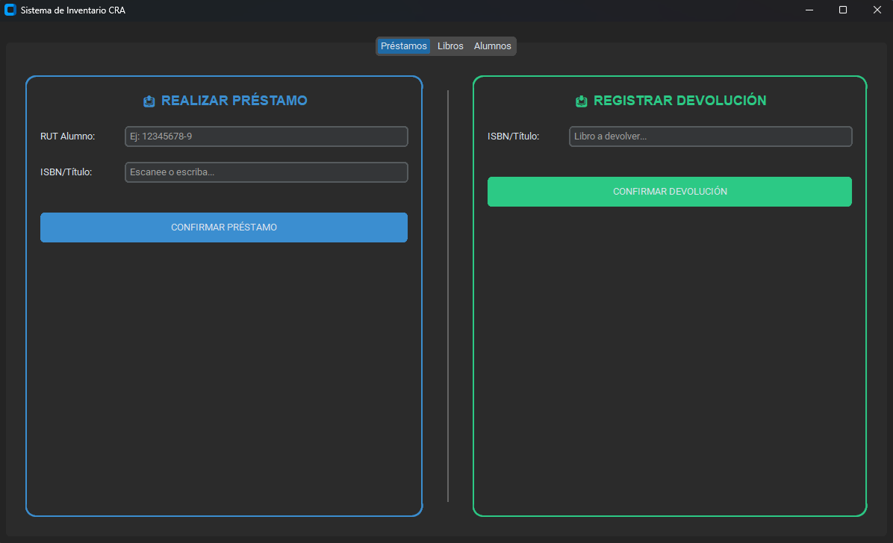
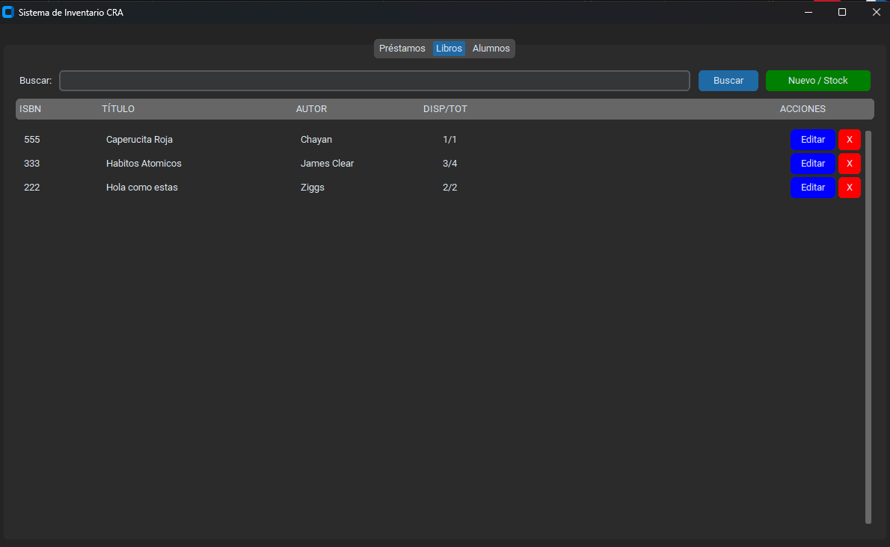
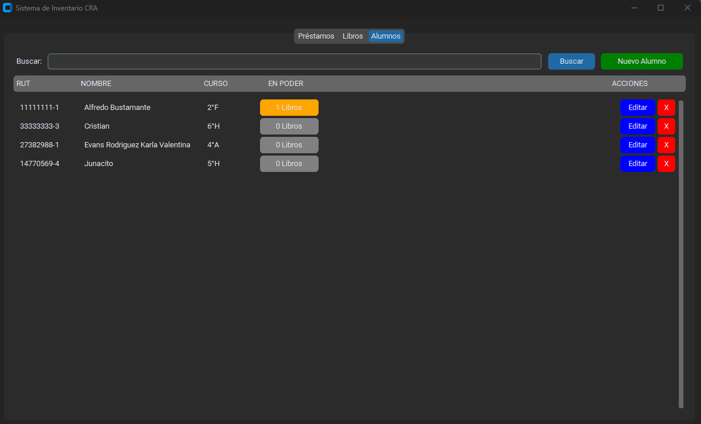

# 📚 Sistema de Gestión de Biblioteca (CRA)

Este proyecto es una aplicación de escritorio desarrollada en **Python** diseñada para facilitar la gestión de recursos literarios de la Biblioteca (CRA) de una escuela.

## 🚀 Características Principales

* **Gestión de Inventario:** Permite agregar, editar y eliminar libros de la base de datos.
* **Control de Préstamos:** Registro de salida y devolución de libros.
* **Base de Datos Local:** Utiliza **SQLite** para un almacenamiento ligero y eficiente sin necesidad de servidores complejos.
* **Interfaz Intuitiva:** Diseñada pensando en la facilidad de uso para el personal bibliotecario.

## 🛠️ Tecnologías Utilizadas

* **Lenguaje:** Python 3
* **Base de Datos:** SQLite
* **Entorno de Desarrollo:** Visual Studio Code
* **Control de Versiones:** Git & GitHub

## 📋 Requisitos Previos

Para ejecutar este sistema, necesitas tener instalado:
* Python 3.x

## 📸 Galería

### 🤝 Control de Préstamos



### 📚 Catálogo de Libros


### 👥 Gestión de Alumnos


## 🔧 Instalación y Uso

1.  Clona el repositorio:
    ```bash
    git clone [https://github.com/fpalaciosg/gestion-biblioteca-app.git](https://github.com/fpalaciosg/gestion-biblioteca-app.git)
    ```
2.  Navega a la carpeta del proyecto:
    ```bash
    cd gestion-biblioteca-app
    ```
3.  Ejecuta el programa principal:
    ```bash
    python sistema_biblioteca.py
    ```

---
Desarrollado por **Francisco J. Palacios González** - *Estudiante de Analista Programador*